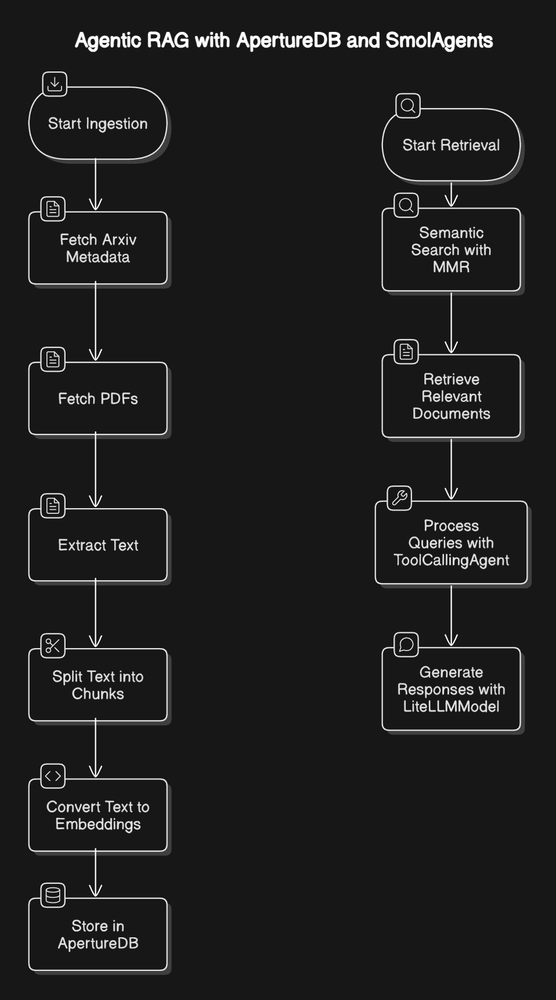

# ArXiv Paper Retrieval and Embedding System

This project enables the retrieval and embedding of scientific papers from ArXiv using OpenAI embeddings and ApertureDB as a vector database. It provides functionality to download, process, and semantically search research papers using LangChain.

## Installation

Ensure you have the necessary dependencies installed:
```bash
pip install opendatasets openai unstructured[pdf] gradio langchain-openai aperturedb pandas langchain-community smolagents 'smolagents[litellm]' arxiv --upgrade --quiet
```

Additional system dependencies:
```bash
sudo apt-get update
apt-get install poppler-utils
pip install tesseract
apt install tesseract-ocr
```

## Architecture Overview
1. Data Ingestion
Fetches metadata and PDFs using opendatasets and arxiv APIs.
Metadata includes paper titles, abstracts, authors, and submission details.

2. Preprocessing & Chunking
Extracts text content from PDFs using unstructured.partition.auto.
Uses RecursiveCharacterTextSplitter to split documents into smaller, manageable chunks for better processing.

3. Vectorization & Storage
Converts text chunks into vector embeddings using OpenAIEmbeddings.
Stores embeddings in ApertureDB, a vector database optimized for semantic search.

4. Retrieval Mechanism
Utilizes a RetrieverTool to perform semantic search on stored embeddings.
Uses Maximal Marginal Relevance (MMR) to ensure diverse yet relevant document retrieval.


## Requirements
- Python 3.8+
- OpenAI API Key
- Kaggle API Key


